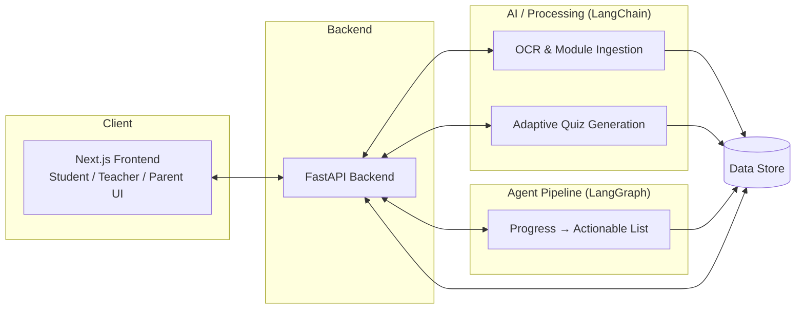

# ARCHITECTURE (Rough)

This is a rough sketch of how the platform's pieces fit together at hackathon scope — not a locked design. See `DETAILS.md` for the product spec this supports.

## System Overview

- **Frontend:** Next.js — student, teacher, and parent-facing UI.
- **Backend:** FastAPI (+ `uv` for dependency/env management) — API layer between frontend, AI processing, and data storage.
- **AI / Processing layer:** LangChain — OCR on uploaded PDFs/photos, NCERT module ingestion/structuring, adaptive quiz generation.
- **Agent pipeline:** LangGraph — consumes student progress/results and produces actionable lists (e.g., "reteach fractions before starting decimals") surfaced to teachers and/or parents.

## Actors

- **Student**
- **Teacher** (school-enrolled mode only)
- **Parent** (both modes — primary account in self-educated mode, secondary/tracking account in school-enrolled mode)
- **Admin / School** (implicit — manages teacher accounts and module publishing rights)

## High-Level Component Diagram

## Key Flows

**1. Diagnostic assessment flow**
Profile creation → adaptive quiz generation (LangChain, orchestrated via LangGraph) → gap identification against prior-grade NCERT topics → gaps compensated for inline within current-grade module delivery.

**2. Module ingestion flow (school-enrolled)**
Teacher uploads a PDF or photo → OCR (LangChain) extracts and structures content → content becomes a usable module → teacher authors an assessment manually, or requests an AI-generated one.

**3. Progress-to-action flow**
Student activity and assessment results → LangGraph agent pipeline processes progress → actionable list generated → surfaced on the teacher dashboard (school-enrolled) and/or parent dashboard.

**4. Self-educated flow**
Student activity and results → same processing pipeline → parental dashboard only (no teacher/school account in the loop).

## Cross-Cutting Concerns

- **Regional language support** touches both content (translated/localized NCERT material) and UI (Next.js i18n).
- **Sign language avatar** sits as a rendering layer over lesson content — generative, driven by lesson text/structure, not a static asset library.
- **NCERT / CBE compliance** constrains where module content and AI-generated material can originate from — this should inform how the LangChain ingestion pipeline sources and validates content.

## Not Yet Decided

Flagged explicitly as open, not implied by anything above:

- Data model / schema (student, teacher, parent, module, assessment, progress entities).
- Auth strategy (roles: student / teacher / parent / admin).
- Hosting / deployment target.
- Avatar generation approach — which model or animation engine drives the generative/live sign-language avatar.
