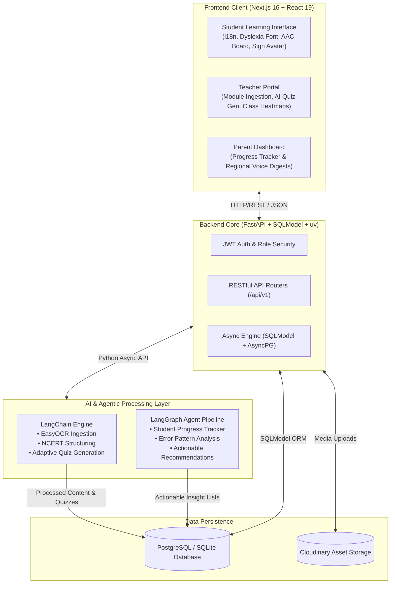
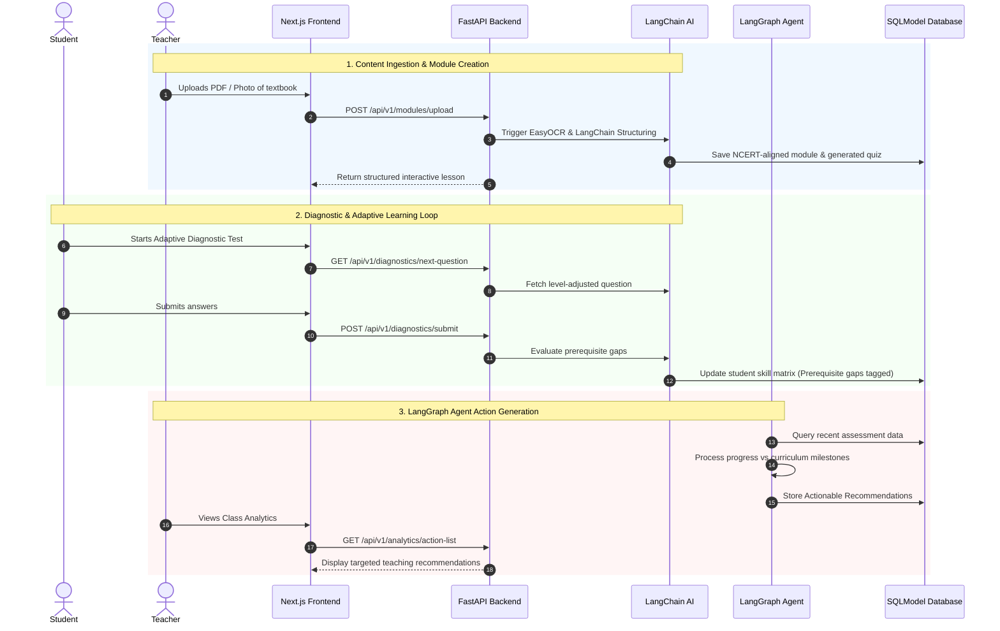

# 🎓 VidyaSetu 
### *AI-Powered Inclusive Education & Adaptive Learning Platform*

[](https://nextjs.org/)
[](https://fastapi.tiangolo.com/)
[](https://www.python.org/)
[](https://www.langchain.com/)
[](https://langchain-ai.github.io/langgraph/)

> **DECODE-SIH Problem Statement 4 (PS4):** Inclusive Education AI to make learning accessible through regional languages, adaptive diagnostics, and assistive technologies.
> 
> *"The goal is not simply to digitize learning — it is to make learning adapt to the learner."*

---

## 📌 Executive Summary

**VidyaSetu** is an end-to-end, AI-powered inclusive education platform designed to close learning gaps before they compound across grades. Built specifically to support diverse learning styles, regional language backgrounds, and special accessibility needs (ADHD, Dyslexia, Hearing/Speech impairments), VidyaSetu sits as an **Adaptive Inclusion Layer** directly around the learner.

Unlike standard LMS platforms or generic AI tutors that merely output performance scores, VidyaSetu integrates **multilingual OCR ingestion**, **adaptive diagnostic testing**, **generative sign-language assistance**, and an **agentic LangGraph pipeline** that translates student activity into actionable, personalized guidance for teachers and parents.

---

## 🎯 Problem Statement & Real-World Alignment

### The Core Challenges

1. **Compounding Prerequisite Gaps:** In traditional classrooms, if a student misses a foundational concept in Grade 4 (e.g., basic fractions), they continuously struggle with Grade 5 topics (decimals, percentages). Existing ed-tech platforms treat grade levels in silos without remediating past gaps.
2. **Language & Accessibility Silos:** Millions of students are forced to consume standardized content in non-native languages or without essential assistive support (dyslexia fonts, sign language, AAC tap-to-speak).
3. **Passive Adult Engagement:** Performance reporting currently shows *what went wrong* (e.g. 45% score in Math) rather than *what to do next* (e.g., "re-teach fraction denominators before starting decimals").
4. **Teacher Sourcing Bottleneck:** Digitizing local physical textbooks or handwritten worksheets is time-consuming for rural and government school educators.

### How VidyaSetu Fills the Gap

| Challenge | Existing Ed-Tech Solutions | VidyaSetu Innovation |
| :--- | :--- | :--- |
| **Learning Gaps** | Static grade-level curriculum | Real-time adaptive diagnostic that compensates prior-grade prerequisite gaps *inline* within current grade modules. |
| **Accessibility** | Separate TTS/STT plugins | Embedded multi-modal accessibility: Dyslexia Karaoke reader, Generative Sign Language Avatar layer, & AAC symbol board. |
| **Teacher/Parent Loop** | Static scorecards & percentiles | **LangGraph Co-Pilot Agent** generating actionable next-step guidance for teachers & regional voice updates for parents. |
| **Content Creation** | Pre-curated, rigid digital content | **Snap & Learn Ingestion Pipeline**: OCR + LangChain processes physical NCERT textbook pages/photos into structured lessons. |

---

## ✨ Key Features & Product Modules

### 1. 🧬 Adaptive Diagnostic & Inline Remediation
- **Prerequisite Gap Identification:** Generates real-time adaptive diagnostic assessments that branch based on student responses.
- **Embedded Remediation:** Instead of forcing students onto a demotivating "remedial track", missing prerequisite concepts are woven seamlessly into current grade lessons.

### 2. 📸 AI Content Ingestion Pipeline ("Snap & Learn")
- **OCR Textbook Processing:** Teachers can snap photos or upload PDFs of any NCERT textbook page.
- **LangChain Parsing:** Extracts, structures, and validates content against NCERT and Central Board of Education (CBE) standards.
- **Automated Quiz Generation:** Generates multi-level assessments automatically from ingested content.

### 3. 🤖 LangGraph Co-Pilot Agent Pipeline
- **Continuous Progress Analysis:** Agent monitors student completion rates, error patterns, and response times.
- **Actionable Insights:** Translates raw test data into concrete recommendations (e.g., *"Student A understands addition but struggles with carry-over values. Provide visual base-10 block exercises."*).

### 4. 🤟 Universal Assistive Technology Layer
- **Generative Sign Language Avatar:** Live 3D/rendered sign-language overlay synchronized with lesson text for deaf & hard-of-hearing students.
- **Dyslexia Mode:** Integrated OpenDyslexic font support, line highlighting, and synchronized karaoke-style audio reading.
- **AAC-Lite Symbol Board:** Tap-to-speak communication board powered by ARASAAC symbols for non-verbal students.
- **Multilingual i18n:** Full support for Indian regional languages across UI and lesson modules.

### 5. 👥 Dual Delivery Modes
- **School-Enrolled Mode:** Integrated view for teachers to publish modules, assign tests, and monitor class-wide heatmaps.
- **Self-Educated Mode:** Direct parent-student loop featuring simplified dashboards and regional voice summaries for parents.

---

## 🏗 System Architecture



---

## 🛠 Tech Stack

| Layer | Technology | Key Usage / Details |
| :--- | :--- | :--- |
| **Frontend Framework** | **Next.js 16** (App Router) | Server-Side Rendering (SSR), React 19, TypeScript |
| **Styling & UI** | **TailwindCSS v4**, Framer Motion | Dynamic dark/light mode, micro-animations, glassmorphism UI |
| **Icons & Assets** | Lucide React | Modern, accessible iconography |
| **Backend Framework**| **FastAPI** | High-performance Python REST API, asynchronous endpoints |
| **Env & Package Mgr**| **uv** | Ultra-fast Python package and virtual environment management |
| **Database & ORM** | **SQLModel** (AsyncPG + SQLAlchemy) | Type-safe async database interactions |
| **AI / NLP Engine** | **LangChain** | OCR document parsing, prompt engineering, NCERT alignment |
| **Agentic Framework**| **LangGraph** | Multi-step stateful reasoning pipeline for progress analytics |
| **OCR & Vision** | **EasyOCR** & Pillow | Multilingual text extraction from images/PDFs |
| **Media Storage** | Cloudinary | Cloud storage for uploaded textbook photos & generated assets |

---

## 🔄 End-to-End System Workflow



---

## 🚀 Getting Started & Installation Guide

### Prerequisites
- **Node.js**: `v18.x` or higher
- **npm**: `v9.x` or higher
- **Python**: `3.11` or higher
- **uv**: Python package manager (`pip install uv` or `curl -LsSf https://astral.sh/uv/install.sh | sh`)

---

### 1. Clone the Repository

```bash
git clone https://github.com/VaibhavChaturvedi03/decode-sih.git
cd decode-sih
```

---

### 2. Backend Setup (FastAPI + uv)

Navigate to the `backend` directory:
```bash
cd backend
```

Create environment file from sample:
```bash
cp .env.sample .env
```

Install dependencies using `uv`:
```bash
uv sync
```

Run database migrations & startup seeds:
```bash
uv run python -m src.main
```

Start the FastAPI development server:
```bash
uv run uvicorn src.main:app --reload --port 8000
```
> 🌐 Backend API will be available at: `http://localhost:8000`  
> 📖 Interactive Swagger API Docs: `http://localhost:8000/docs`

---

### 3. Frontend Setup (Next.js 16)

Open a new terminal window and navigate to the `frontend` directory:
```bash
cd frontend
```

Install packages:
```bash
npm install
```

Start the Next.js development server:
```bash
npm run dev
```
> 🌐 Frontend Application will be live at: `http://localhost:3000`

---

## 📁 Repository Directory Structure

```directory
decode-sih/
├── ARCHITECTURE.md                 # Detailed architectural specifications
├── DETAILS.md                      # Product vision & feature details
├── inclusive-education-ai-notes.md  # DECODE-SIH strategy & competitive breakdown
├── backend/                        # FastAPI Backend Application
│   ├── pyproject.toml              # uv project dependencies
│   ├── uv.lock                     # Lockfile for reproducible builds
│   ├── render.yaml                 # Deployment configuration
│   └── src/
│       ├── main.py                 # FastAPI application entrypoint & lifecycle
│       ├── api/                    # REST API route controllers
│       ├── core/                   # Security, DB connections & app config
│       ├── db/                     # Seed scripts & database setup
│       ├── models/                 # SQLModel ORM schemas
│       ├── schemas/                # Pydantic request/response validation
│       ├── services/               # Business logic & AI pipelines
│       └── utils/                  # OCR helpers & text processors
└── frontend/                       # Next.js 16 Web Application
    ├── package.json                # Frontend dependencies (React 19, Tailwind)
    ├── next.config.ts              # Next.js configuration
    ├── app/                        # Next.js App Router (Pages & Layouts)
    ├── components/                 # Reusable UI & Assistive components
    ├── hooks/                      # Custom React hooks
    └── public/                     # Static assets & icons
```

---

## 💻 How Others Can Use & Extend VidyaSetu

VidyaSetu is architected as an open modular framework. Here is how developers, schools, and researchers can utilize and build upon this platform:

1. **For Schools & Educational Institutions:**
   - Deploy VidyaSetu to digitize offline NCERT modules and monitor students' learning gaps in real time.
   - Use the Teacher Dashboard to generate AI-assisted adaptive quizzes mapped directly to CBSE learning outcomes.

2. **For Special Educators & Accessibility Researchers:**
   - Extend the **Assistive Technology Layer** by plugging in custom sign-language avatar models or additional AAC symbol sets (e.g., ARASAAC).
   - Integrate custom TTS/STT models for regional dialects.

3. **For Developers & Open-Source Contributors:**
   - **LangGraph Pipelines:** Add new agent nodes in `backend/src/services/` to expand diagnostic insights (e.g., detecting ADHD hyper-fixation or learning fatigue).
   - **Offline-First Capabilities:** Connect the backend REST APIs to local mobile databases (e.g., WatermelonDB / SQLite) for zero-connectivity rural deployments.

---
